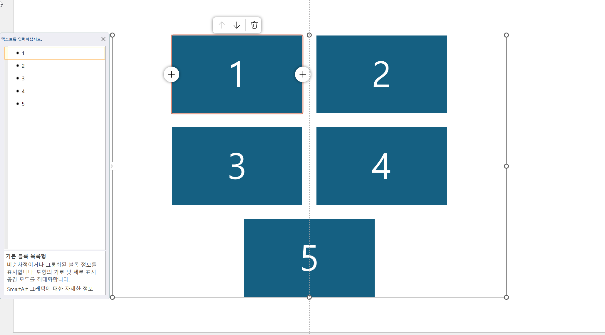
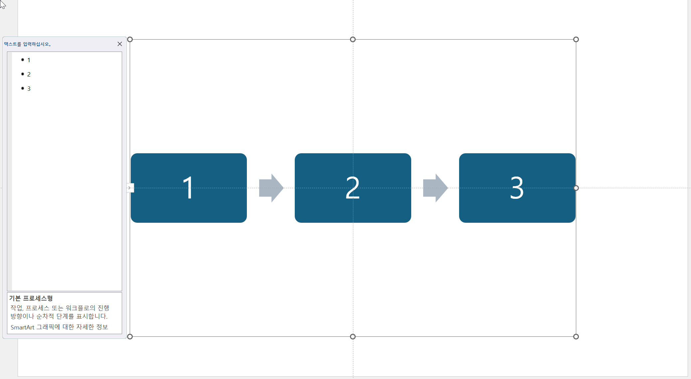
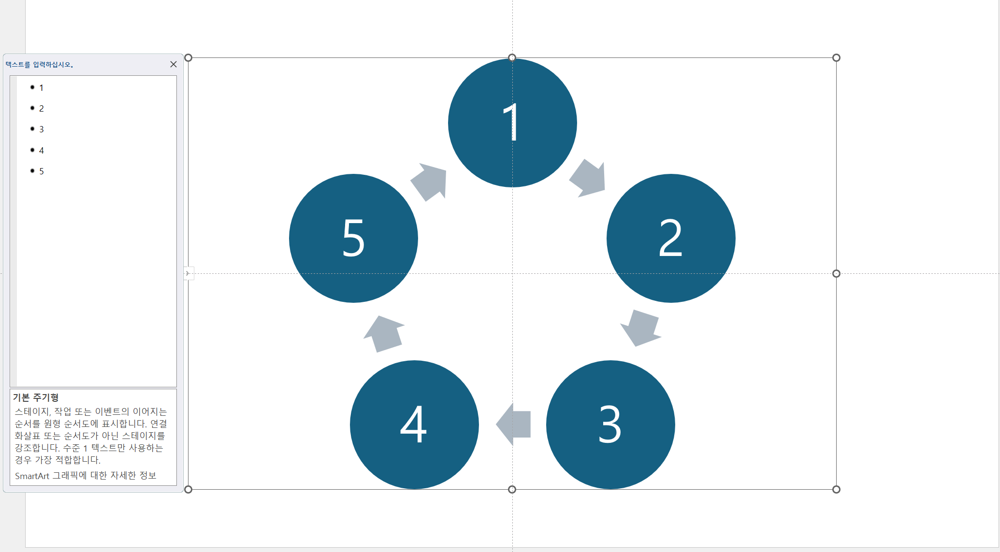
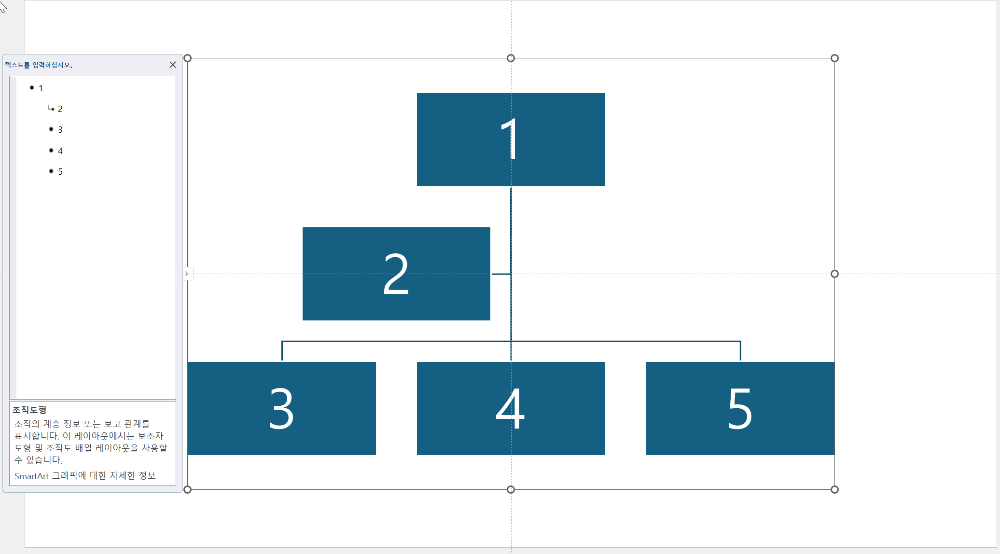
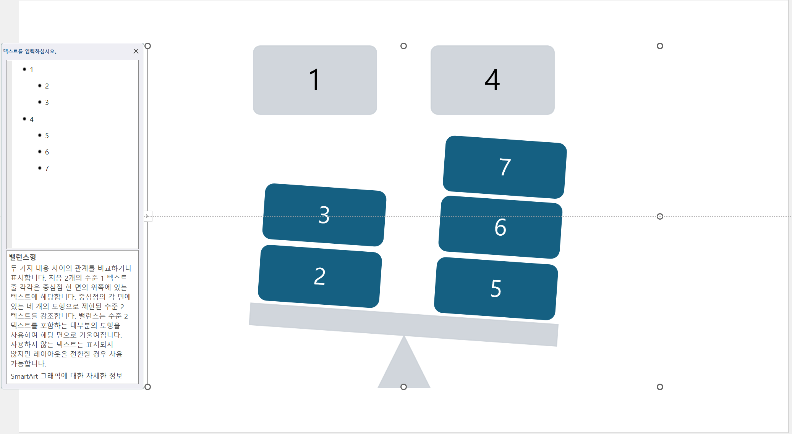
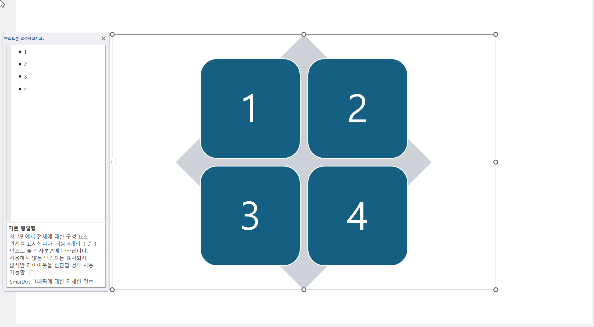
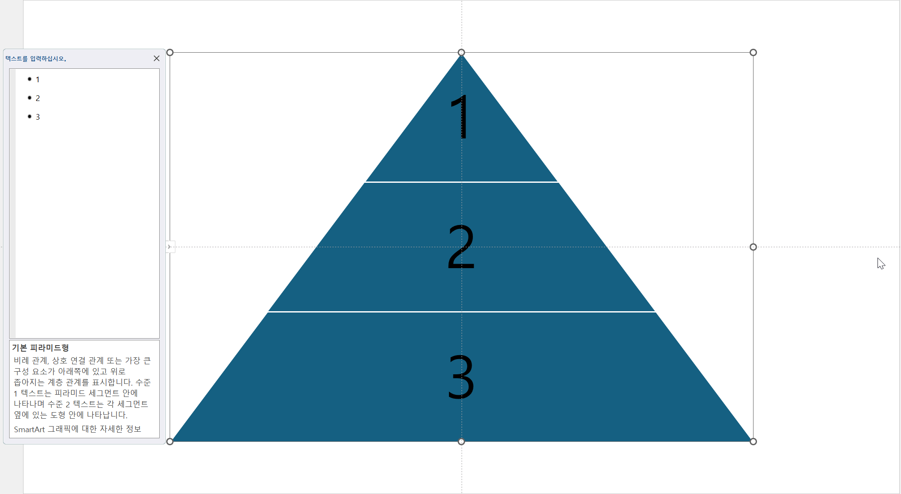
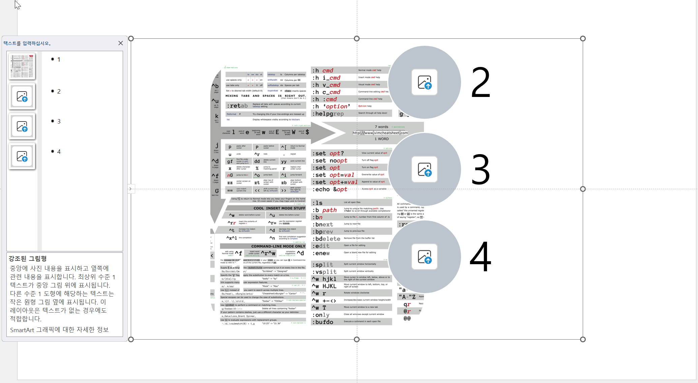
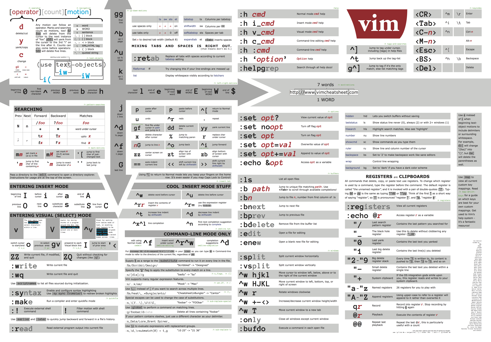

# SmartArt2md

OOXML (Office Open XML) 파일에 포함된 SmartArt 다이어그램을 Markdown 리스트로 변환하는 순수 Python 패키지입니다. ECMA-376 표준을 기반으로 구현되었으며, 외부 의존성이 없습니다.

## 설치

```bash
pip install smartart2md
```

## 두 가지 핵심 함수

### `load_smartart_parts(path)`

OOXML 파일에서 SmartArt dataModel 파트를 찾아 `(ET.Element, ZipContext)` 쌍의 목록으로 반환합니다.

- **`.pptx`**: `presentation.xml`의 `sldIdLst` 순으로 탐색하므로 슬라이드 순서가 보장됩니다.
- **`.xlsx` / `.docx`**: 슬라이드 개념이 없으므로 파일명 natural sort로 탐색합니다.

**제약:** 슬라이드 컨텍스트(어느 슬라이드의 다이어그램인지)를 알 수 없습니다. 단독으로 변환 결과를 빠르게 확인하는 용도에 적합합니다.

### `convert_smartart(root, ctx)`

SmartArt dataModel XML 루트 `ET.Element`를 받아 `(markdown_str, images)` 튜플을 반환합니다. `parOf` 연결 관계를 따라 계층 구조를 들여쓰기 불릿 목록으로 렌더링하며, 노드에 포함된 이미지는 `[(bytes, ext), ...]` 형태로 분리 반환합니다.

```python
from smartart2md import convert_smartart, load_smartart_parts

for root, ctx in load_smartart_parts("presentation.pptx"):
    md, images = convert_smartart(root, ctx)
    print(md)
    # images: [(bytes, ext), ...]
```

### 코드 사용 예시

```python
from smartart2md import convert_smartart, load_smartart_parts

for root, ctx in load_smartart_parts("presentation.pptx"):
    md, images = convert_smartart(root, ctx)
    print(md)
```

---

## CLI — 변환 결과 빠르게 확인하기

`load_smartart_parts()`를 사용하므로 슬라이드 순서와 관계없이 파일 안의 모든 SmartArt를 변환해 출력합니다. 특정 파일의 SmartArt가 어떻게 변환되는지 확인하거나 디버깅할 때 유용합니다.

```bash
smartart2md input.pptx                  # 모든 SmartArt를 stdout으로 출력
smartart2md input.pptx -o output.md     # 파일로 저장
smartart2md diagram.xml                 # dataModel XML 직접 입력
```

`-o output.md`로 파일을 저장할 경우, SmartArt 노드에 포함된 이미지는 `output_assets/` 디렉터리에 자동으로 저장되며 Markdown 내 플레이스홀더는 이미지 링크로 대체됩니다.

---

## Full Pipeline 통합 — PPTX 전체를 MD로 변환할 때

PPTX 전체를 슬라이드 순서대로 Markdown으로 변환하는 파이프라인을 구축할 때는 `load_smartart_parts()`를 쓰지 않습니다. 대신 다음 흐름으로 직접 처리합니다.

1. `ppt/presentation.xml`의 `sldIdLst`에서 슬라이드 순서를 읽는다.
2. 각 슬라이드 XML을 순서대로 파싱하며 `p:graphicFrame` shape을 순회한다.
3. `a:graphicData[@uri]`에 `"diagram"`이 포함되면 SmartArt로 판단한다.
4. `dgm:relIds`의 `r:dm` 속성에서 r:id를 추출하고 슬라이드 `.rels`에서 resolve해 dataModel 파일 경로를 얻는다.
5. 해당 경로로 `ZipContext`를 직접 구성하고 `convert_smartart(root, ctx)`를 호출한다.

```python
from smartart2md import convert_smartart, ZipContext
import xml.etree.ElementTree as ET

# shape 순회 중 SmartArt를 만났을 때
data_path = slide_rels[dm_rid]                      # r:dm → 경로 resolve
data_root = ET.fromstring(zf.read(data_path))
ctx = ZipContext(zf, data_path)
md, images = convert_smartart(data_root, ctx)
```

---

## 출력 형식

부모-자식 관계(`parOf` 연결)가 있으면 계층 구조로, 없으면 다이어그램 카테고리에 따라 플랫 목록으로 렌더링됩니다.

```markdown
- 루트 항목
  - 자식 항목
  - 자식 항목
- 루트 항목
  - 자식 항목
```

SmartArt 노드에 포함된 이미지는 `[(bytes, ext), ...]`로 분리 반환되며, Markdown 내에는 `@@IMG:N@@` 플레이스홀더로 대체됩니다.

---

## 변환 결과 예시

좌측은 실제 프레젠테이션 슬라이드의 다이어그램이며 우측은 본 패키지를 통해 렌더링된 결과입니다. 샘플 파일에 포함된 8개의 다이어그램들이 각각 순서대로 Markdown 리스트로 변환되었습니다.

원본 다이어그램 형태 | 변환된 Markdown 리스트
:---:|:---:
 | <pre>- 1<br>- 2<br>- 3<br>- 4<br>- 5</pre>
 | <pre>- 1<br>- 2<br>- 3</pre>
 | <pre>- 1<br>- 2<br>- 3<br>- 4<br>- 5</pre>
 | <pre>- 1<br>  - 2<br>  - 3<br>  - 4<br>  - 5</pre>
 | <pre>- 1<br>  - 2<br>  - 3<br>- 4<br>  - 5<br>  - 6<br>  - 7</pre>
 | <pre>- 1<br>- 2<br>- 3<br>- 4</pre>
 | <pre>- 1<br>- 2<br>- 3</pre>
 | <pre>- 1<br><br>  <br>- 2<br>- 3<br>- 4</pre>

---

## 지원 입력 형식

- **`.pptx`, `.xlsx`, `.docx`** — OOXML 아카이브 내 `*/diagrams/data*.xml`을 자동으로 탐색
- **`.xml`** — `dgm:dataModel` 루트로 직접 파싱
